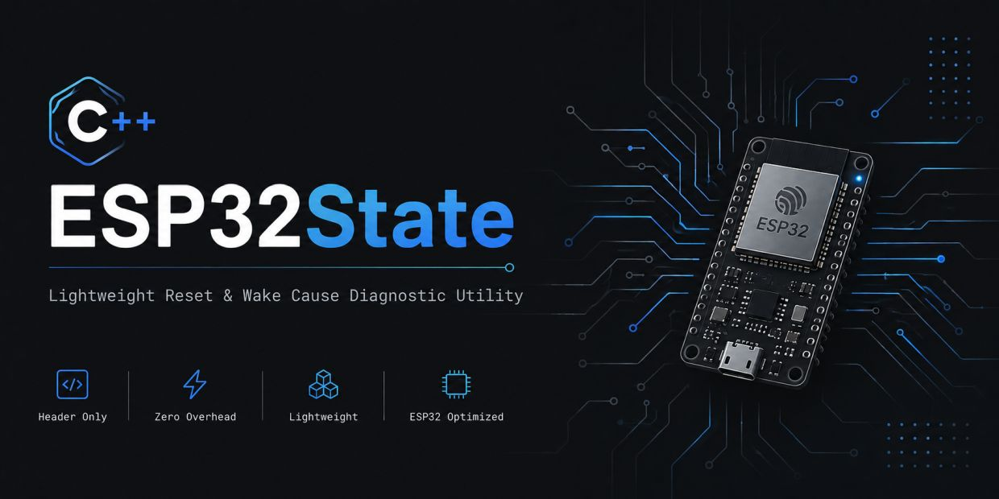

# ESP32State

[](https://github.com/artkeller/ESP32State)
[-informational?style=flat-square)](./CRA-Exemption.md)
[](./LICENSE)
[](./README.md)




Eine deterministische, **Zero-Heap C++17 Hardware Abstraction Layer (HAL)** und Zustands-Diagnose-Bibliothek für die gesamte ESP32-SoC-Familie. 

`ESP32State` eliminiert unübersichtlichen Makro-Code im Hauptprogramm und bietet eine sichere, seiteneffektfreie Laufzeit-Diagnose von Reset-Gründen, Wakeup-Ursachen und Hardware-Features im Panic-Raum.

---

## 🔌 Multi-SoC Abstraktion

`ESP32State` unterstützt **alle 14 ESP32 Silicon-Varianten** nahtlos und löst modellspezifische Register-Unterschiede zur Compile-Zeit auf:

`ESP32` | `ESP32-S2` | `ESP32-S3` | `ESP32-S31` | `ESP32-C2` | `ESP32-C3` | `ESP32-C5` | `ESP32-C6` | `ESP32-C61` | `ESP32-H2` | `ESP32-H4` | `ESP32-H21` | `ESP32-P4` | `ESP32-E22`

> 📘 **Hardware-Matrix:** Eine detaillierte Übersicht aller Chip-Spezifikationen und Register-Layouts findest du im Referenz-Repository [**ESP32Features**](https://github.com/artkeller/ESP32Features).

---

## 🚀 Minimalistischer 1-Zeiler Hauptsketch (`main.cpp` / `.ino`)

Dank des **Enterprise Governance Patterns** schrumpft die Hauptdatei deines Projekts auf ein Minimum. Die gesamte Initialisierung und Diagnose ist in projektspezifische Header ausgelagert:

```cpp
#include <Arduino.h>
#include "project_state_policy.h"

void setup() {
    Serial.begin(115200);
    
    // EIN EINZIGER AUFRUF: Führt die unternehmensweite Zustands-Governance aus
    ProjectState::evaluateAndBoot();
    
    // Normaler Anwendungs-Code startet hier...
}

void loop() {
    // Regular application code
}

----- xxxxx

# ESP32State

[-informational)](./CRA-EXEMPTION.md)
[](./LICENSE)
[](./README.md)
[](https://github.com/artkeller/ESP32State)


**Deterministische Diagnoseschicht & Panic-Raum-Logik für ESP32**

Ein ESP32 im Feld startet aus unterschiedlichsten Gründen neu: Kaltstart, Deep-Sleep-Timer, Brownout, Watchdog-Reset oder Speicherabsturz (Panic). Standardmäßig führt der ESP32 nach jedem Neustart blind `setup()` aus – ohne dass die Anwendung deterministisch weiß, in welchem Sicherheitszustand das System erwacht.

**`ESP32State`** schließt diese Sicherheitslücke: Es bietet eine unbestechliche, seiteneffektfreie Prüfmatrix zum Systemstart. Neustart- und Aufwachursachen sowie kritische Hardware-Bedingungen werden **explizit, transparent und ohne unvorhersehbare Code-Magie** registriert und ausgewertet.

* **CRA-Ready:** Unterstüzt Entwickler bei der Einhaltung von Robustheits- und Sicherheitsanforderungen des EU Cyber Resilience Acts (CRA).
* **Zero-Magic & Versiegelbar:** Keine verdeckten Kaskadeneffekte, keine versteckten State-Machines. Was du definierst, wird stumpf, sicher und auditierbar abgearbeitet.
* **Zero-Overhead:** Kompakt, performant und ideal für professionelle embedded Systeme.

---

## Wozu diese Bibliothek?

Im Feldeinsatz (z. B. Industrial IoT oder autarke Sensorknoten) müssen  beim Booten **sofort unmissverständliche Entscheidungen** getroffen werden:

* **Normaler Deep Sleep?** $\rightarrow$ Messwerte senden und sofort wieder schlafen.
* **Spannungsausfall (Power-On / Brownout)?** $\rightarrow$ Peripherie neu kalibrieren, RTC-RAM prüfen.
* **Kritischer Absturz (Watchdog / Panic)?** $\rightarrow$ In den sicheren Notfall-Modus (*Panic-Raum*) schalten, Fehler im NVS protokollieren und Re-Flash vorbereiten.

Anstatt unleserliche `if-else`-Verschachtelungen über Espressif-C-Register zu schreiben, verpackt `ESP32State` diese Evaluierung in saubere, deklarative **ConditionPairs** (Bedingung + Aktion).

---

## Multi-SoC Unterstützung & Hardware-HAL

`ESP32State` ist von Grund auf agnostisch entworfen und unterstützt **alle 14 ESP32 Silicon-Varianten** nahtlos:
`ESP32` | `ESP32-S2` | `ESP32-S3` | `ESP32-S31` | `ESP32-C2` | `ESP32-C3` | `ESP32-C5` | `ESP32-C6` | `ESP32-C61` | `ESP32-H2` | `ESP32-H4` | `ESP32-H21` | `ESP32-P4` | `ESP32-E22`

Die integrierte Hardware Abstraction Layer (`variants/ESP32State_HAL.h`) löst abweichende Register-Layouts und Wakeup-Capabilities (EXT0/EXT1, Touch, ULP, RTC-RAM) vollständig zur **Compile-Zeit** auf. Dein Anwendungscode bleibt 100 % agnostisch, ohne dass Du Makro-Weichen im Hauptprogramm schreiben musst.

> **Hardware-Referenz:** Eine detaillierte Übersicht aller Chip-Spezifikationen, Register-Anforderungen und Deep-Sleep-Eigenschaften findest du im Repository [**ESP32Features**](https://github.com/artkeller/ESP32Features).

---


## Schnellstart (Minimalbeispiel)

```cpp
#include <Arduino.h>
#include <ESP32State.h>

void setup() {
    Serial.begin(115200);
    delay(1000);

    // 1. Logger konfigurieren (optional, zeigt Details im Seriellen Monitor)
    ESP32State::configure(&Serial, ESP32State::LogLevel::INFO);

    // 2. Bedingungen definieren: WENN (Bedingung erfüllt) DANN (Aktion ausführen)
    ESP32State analyzer({
        {
            []() { return esp_reset_reason() == ESP_RST_POWERON; },
            []() { ESP32STATE_LOG(ESP32State::LogLevel::INFO, "Erster Start: Frisch am Strom!"); }
        },
        {
            []() { return esp_reset_reason() == ESP_RST_DEEPSLEEP; },
            []() { ESP32STATE_LOG(ESP32State::LogLevel::INFO, "Aus dem Tiefschlaf erwacht."); }
        },
        {
            []() { return esp_reset_reason() == ESP_RST_PANIC; },
            []() { ESP32STATE_LOG(ESP32State::LogLevel::ERROR, "ACHTUNG: Letzter Neustart war ein Absturz!"); }
        }
    });

    // 3. Analyse starten (prüft alle Regeln und führt Treffer aus)
    ESP32State::AnalysisResult result = analyzer.analyze();
}

void loop() {
    // Bleibt leer – die Diagnose läuft einmalig beim Booten
}

```

---

## So strukturierst du es im Profi-Projekt

Damit deine `main.cpp` oder `.ino` übersichtlich bleibt, lagere die Logik wie folgt aus:

### 1. Datei `setup_state.h`

```cpp
#ifndef SETUP_STATE_H
#define SETUP_STATE_H

#include <ESP32State.h>

inline void initSystemState() {
    ESP32State::configure(&Serial, ESP32State::LogLevel::INFO);

    static ESP32State analyzer({
        {
            []() { return esp_reset_reason() == ESP_RST_POWERON; },
            []() { Serial.println("Normaler Kaltstart."); }
        },
        {
            []() { return esp_reset_reason() == ESP_RST_TASK_WDT; },
            []() { Serial.println("Fehler: Task Watchdog Reset!"); }
        }
    });

    analyzer.analyze();
}

#endif // SETUP_STATE_H

```

### 2. Hauptdatei `.ino`

```cpp
#include <Arduino.h>
#include "setup_state.h"

void setup() {
    Serial.begin(115200);
    
    // Einfacher, sauberer Aufruf!
    initSystemState();
}

void loop() {
    // Deine eigentliche Anwendungslogik
}

```

---


## Praxistipp für saubere Projekte

> **Praxis-Hinweis:** In den Beispiel-Dateien (`.ino`) dieser Bibliothek steht die Initialisierung häufig direkt in der Funktion `setup()`. Das dient **ausschließlich der Didaktik und Lesbarkeit**.
> Für den raealen Projekteinsatz wird empfohlen, den Initialisieungscode in eine eigene Datei (z. B. `setup_state.h` oder `setup_system.h`) zu isolieren. In der Haupt-`.ino` wird nur noch eine Funktion aufgerufen; die Hauptdatei belibt übersichtlich und leicht wartbar!

---

## 🛠️ Fortgeschritten: Zielgerichtete HW-Abfragen mit der HAL

Für chipspezifische Notfall-Logiken (z. B. wenn ein Feature wie `EXT0` nur auf bestimmten SoCs wie dem ESP32, S2 oder S3 existiert) stellt die HAL saubere Feature-Flags bereit. Der Compiler eliminiert den Code auf Chips ohne Unterstützung automatisch (**0 Bytes Flash-Overhead**):

```cpp
#include <ESP32State.h>
#include <variants/ESP32State_HAL.h>

// 1. Target-Name agnostisch abfragen:
ESP32STATE_LOG(ESP32State::LogLevel::INFO, "Running on Target: " ESP32State::HAL::getTargetName());

// 2. Hardware-Capabilities sicher zur Compile-Zeit prüfen:
#if ESP32STATE_HAS_EXT0_WAKEUP
    {
        []() { return ESP32State::HAL::getWakeupCause() == ESP_SLEEP_WAKEUP_EXT0; },
        []() { Serial.println("Aufgewacht via EXT0 Pin!"); }
    }
#endif

```

---

## Das Anwendungs-1x1: Welches Beispiel erklärt was?

Für Schritt-für-Schritt-Lernen enthält der Ordner [`examples/`](examples) 10 fertige Demos:

| Nr. | Thema | Ziel |
| --- | --- | --- |
| **01** | `01_BasicStartupAnalysis` | **Der Einstieg:** Grundlagen der Analyse verstehen. |
| **02** | `02_ConditionsInFile` | **Struktur:** Regeln in eigene Dateien auslagern. |
| **03** | `03_DynamicConditions` | **Flexibilität:** Regeln zur Laufzeit dynamisch hinzufügen. |
| **04** | `04_CustomLogger` | **Diagnose:** Eigenes Logging und Log-Level steuern. |
| **05** | `05_AnalysisResultEvaluation` | **Auswertung:** Ergebnisse (Dauer, Treffer) programmtechnisch nutzen. |
| **06** | `06_PersistentErrorHandling` | **Speicher:** Fehlerzähler im EEPROM/NVS über Reboots hinweg sichern. |
| **07** | `07_DeepSleepRTCTracking` | **Energy:** Deep-Sleep-Zyklen im RTC-RAM mitverfolgen. |
| **08** | `08_EnvironmentConditions` | **Hardware:** Sensoren, Akku-Spannung & Temperatur überwachen. |
| **09** | `09_SafetyAndSecurity` | **Sicherheit:** Abstürze (Watchdog, Panic) gezielt abfangen. |
| **10** | `10_ComprehensiveConditions` | **Vollständig:** Alle ESP-IDF Reset- & Wakeup-Gründe im Überblick. |

---

## Installation

### Arduino IDE

1. Lade das Repository als `.zip` herunter.
2. Navigiere in der Arduino IDE zu **Sketch ➔ Bibliothek einbinden ➔ .ZIP-Bibliothek hinzufügen...**

### PlatformIO

Füge die Bibliothek zu deiner `platformio.ini` hinzu:

```ini
lib_deps =
    ESP32State

```

---

## Lizenz

Veröffentlicht unter der MIT-Lizenz. Freie Nutzung in privaten und kommerziellen Projekten erlaubt.
